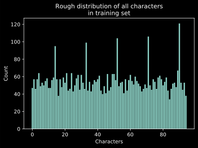
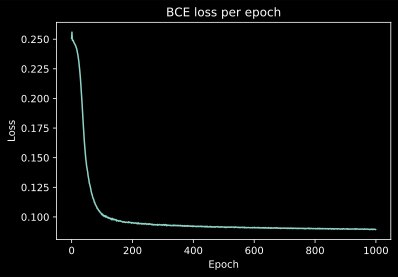
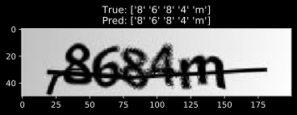
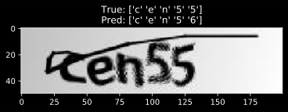
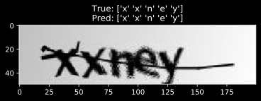
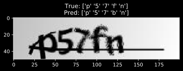
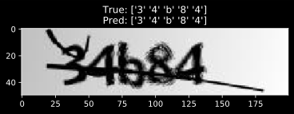

## CAPTCHA image recognition
### By Ali Shannon

The data is obtained from [Kaggle](https://www.kaggle.com/fournierp/captcha-version-2-images) which provides labeled datasets for ML practice.
The goal here is to use computer vision provided by torchvision from pytorch to read and attempt to recognize lettersin in CAPTCHA images.
The only downside is that labels are not uniformly distributed so some discrepancies may occur. A larger dataset with more variations may prove helpful.

Each CAPTCHA image has exactly 5 characters and they could be letters or numbers, the labels are inferred from the training data.
If a new character is introduced, this model will not perform well since it does not have it in the dictionary of characters as explained by the encoder. For encoding I am using the scikit-learn `OneHotEncoder` class which replaces the matrix of characters into a more sparse matrix of zeros and ones.


```python
from matplotlib import pyplot as plt
from glob import glob
from PIL import Image
import numpy as np
from sklearn.model_selection import train_test_split
from sklearn.preprocessing import OneHotEncoder
from torchvision import transforms
from torch.utils.data import DataLoader, TensorDataset
from torch import nn, optim
from torch.nn import functional as F
import torch

DEVICE = 'cuda' if torch.cuda.is_available() else 'cpu'
PATH = 'samples/*.png'
```

Import all images and labels


```python
pics = {}
for image_file in glob(PATH):
    #label = image_file.split('/')[-1].split('.')[0] # linux version
    label = image_file.split('\\')[-1].split('.')[0]
    with Image.open(image_file) as pic:
        pics[label] = np.asarray(pic)


# The data needs to be array-like for train_test_split
x = list(map(transforms.ToTensor(), pics.values()))
y = list(map(list, pics.keys()))
```

Set up the encoder to create ones and zeros


```python
encoder = OneHotEncoder().fit(y)
y_encoded = encoder.transform(y).toarray()
```


```python
distribution_of_chars = np.sum(y_encoded, axis=0)
plt.bar(np.arange(len(distribution_of_chars)), distribution_of_chars)
plt.title('Rough distribution of all characters\nin trainin')
plt.xlabel('Characters')
plt.ylabel('Count')
plt.show()
```





Split into train and test sets


```python
x_train, x_test, y_train, y_test = train_test_split(
    x, y_encoded, test_size=0.33, random_state=42)
```

Tensorize all of them to prep for neural network


```python
x_train = torch.stack(x_train)
x_test = torch.stack(x_test)
y_train = torch.tensor(y_train)
```

Define the CNN


```python
class CNN(nn.Module):
    def __init__(self):
        super().__init__()
        self.feats = nn.Sequential(
            nn.Conv2d(4, 24, kernel_size=2, stride=2),
            nn.AvgPool2d(kernel_size=2),
            nn.Dropout(0.2),
            nn.Conv2d(24, 48, kernel_size=2),
            nn.MaxPool2d(kernel_size=2),
            nn.Dropout(0.2),
        )
        self.fc = nn.Linear(5760, 95)

    def forward(self, x):
        x = self.feats(x)
        x = x.flatten(1)
        x = self.fc(F.relu(x))
        return F.softmax(x, -1)

model = CNN()
model.double().to(DEVICE)

error = nn.BCELoss()
opt = optim.Adam(model.parameters())
```

Define the train function and start training.


```python
y_t = y_train.to(DEVICE)
x_t = x_train.double().to(DEVICE)

def train(x, y, num_epochs=1000):
    losses = []
    model.train()
    for epoch in range(1, 1 + num_epochs):
        opt.zero_grad()
        out = model(x.double().to(DEVICE))
        loss = error(out, y_t)
        loss.backward()
        opt.step()
        losses.append(loss.item())
        if epoch % int(0.1 * num_epochs) == 0:
            print(f'Epoch: {epoch} \t loss: {loss.item()}')
    return losses

losses = train(x_t, y_t)
plt.plot(losses)
plt.title('BCE loss per epoch')
plt.xlabel('Epoch')
plt.ylabel('Loss')
plt.show()
```

    Epoch: 100 	 loss: 0.10280555339796826
    Epoch: 200 	 loss: 0.09527726726109494
    Epoch: 300 	 loss: 0.0932475486697658
    Epoch: 400 	 loss: 0.0918443012334607
    Epoch: 500 	 loss: 0.09139890883700973
    Epoch: 600 	 loss: 0.09084757545282005
    Epoch: 700 	 loss: 0.0905401900598109
    Epoch: 800 	 loss: 0.09017886497628548
    Epoch: 900 	 loss: 0.08985160414548853
    Epoch: 1000 	 loss: 0.08942246852779413
    





Run model on test set


```python
with torch.no_grad():
    out = model(x_test.double().to(DEVICE)).cpu().detach().numpy()

# Decode the ones and zeros matrix
res = encoder.inverse_transform(out)
true = encoder.inverse_transform(y_test)

test_images = list(map(transforms.ToPILImage(), x_test))
```

Sample and show results


```python
for s in np.random.choice(len(x_test) - 1, size=5):
    plt.tit(f'True: {true[s]}\nPred: {res[s]}')
    plt.imshow(test_images[s])
    plt.show()
```

















Write a scoring algorithm for multilabel classifier
I chose to go with giving it partial credit for getting some characters correct even though it wouldn't pass a CAPTCHA test.


```python
def multi_label_score(true, res):
    score = []
    for x, y in zip(true, res):
        if all(x == y):
            score.append(1)
        elif any(x == y):
            score.append(sum(x == y) / len(x))
        else:
            score.append(0)
    return sum(score) / len(score) * 100

print(f'Accuracy score: {multi_label_score(true, res):.4g}%')
```

    Accuracy score: 79.3%
    

This is pretty good for a back of the napkin code that tries to cheat CAPTCHA
